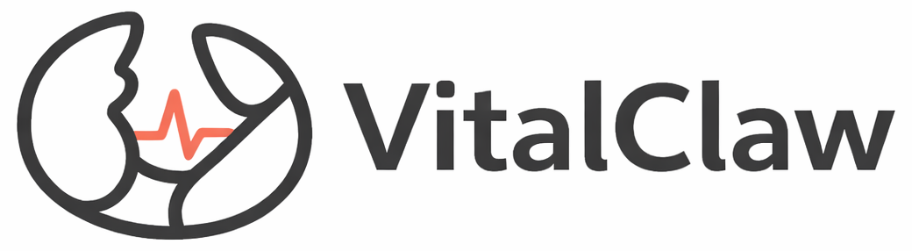
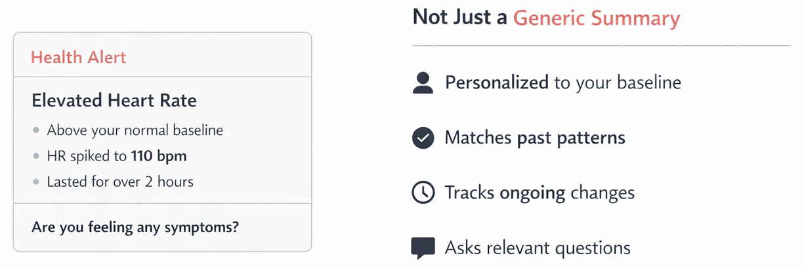
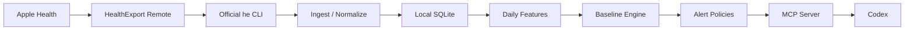

<p align="center">
  
</p>

<p align="center">
  Keeps a grip on your baseline.
</p>

<p align="center">
  <a href="https://github.com/kuzeze/VitalClaw/blob/main/LICENSE"></a>
  
  
  
  
</p>

VitalClaw is a local-first personal health observability engine for Apple Health, built to work naturally with Codex.

It pulls your Apple Health data locally, learns your baseline over time, and stays quiet unless your data meaningfully drifts from your normal.

This is not a generic AI health chatbot.  
This is not a diagnosis product.  
This is a monitoring engine with Codex as the interface.

> No news is good news.  
> VitalClaw only speaks when the drift is worth your attention.

## Overview

VitalClaw is aimed at one layer:

- `longitudinal memory`
- `personal baseline`
- `low-noise alerting`
- `context-aware follow-up`
- `quiet-by-default monitoring`

The core question is:

> Is this just noise, or is something actually drifting?

Current v1 scope:

- `Apple Health only`, via `HealthExport Remote`
- `local-first`, with project-local SQLite under `.vitalclaw/`
- `Codex-native`, with CLI + MCP surfaces
- `baseline-aware`, not population-threshold-first
- `precision-first`, with one alert family in v1: `recovery_suppression`
- `quiet by default`, with scheduled checks and selective alerts

## Product Principle

VitalClaw should not behave like a daily wellness bot that constantly talks.

Its default state is silence:

- it keeps watching
- it keeps learning your normal
- it keeps checking for drift
- it only interrupts when the drift is strong enough to deserve attention

That means the product is not trying to maximize summaries, charts, or AI commentary.

It is trying to reduce how often you need to look at your own health data.

The standard is not:

`Did we detect an anomaly?`

The standard is:

`Is this worth interrupting you for?`

## Anatomy of an Alert

<p align="center">
  
</p>

The point is not “AI looked at my chart.”

The point is:

- raw signals become daily features
- daily features are compared to a personal baseline
- multiple corroborating deviations are required before opening an alert
- the model is used for explanation and follow-up, not threshold invention
- the system is designed to stay silent when nothing is worth attention

## Demo

```text
$ vitalclaw sync
✓ Pulled fresh data from HealthExport Remote
✓ Normalized local observations into SQLite

$ vitalclaw alerts
status: ok
No alert-worthy drift detected from recent personal baseline.
No user-facing interruption sent.
```

```text
$ vitalclaw alerts
status: new_alert
⚠ recovery_suppression
  Multiple recovery markers drifted together for 3 days
  Follow-up: Any symptoms in the last 48 hours?

$ vitalclaw explain --latest
Changed: HRV down, resting HR up, sleep below baseline
Missing context: Any symptoms in the last 48 hours?
History: No prior similar episode has been recorded.
```

## Workflow



Daily checks are meant to run on a schedule.

The intended behavior is:

1. `sync`
2. `materialize`
3. `check alerts`
4. stay silent if the result is not worth attention
5. only explain or follow up when a new, unresolved, or worsening alert exists

VitalClaw currently monitors:

- `sleep_duration_hours`
- `resting_heart_rate`
- `heart_rate_variability_sdnn`
- `respiratory_rate`
- `wrist_temperature_celsius`

## Quick Start

### Easiest Path

1. Clone the repo.
2. Add it as a Codex `project`.
3. Tell Codex to set up VitalClaw.
4. Install `Health Export CSV` on iPhone and enable `Remote`.
5. Copy your account key from:

[`https://remote.healthexport.app/settings/sharing`](https://remote.healthexport.app/settings/sharing)

6. Paste the key into the Codex chat.
7. Done.

Codex should handle the rest:

- install the local package
- verify or install the official `he` CLI
- create `.vitalclaw/`
- save local config
- sync your health data
- build daily features
- run the first alert pass

### Manual Fallback

```bash
python3 -m pip install -e .
vitalclaw init --account-key "<your-account-key>"
```

## Main Commands

```bash
vitalclaw sync
vitalclaw materialize
vitalclaw alerts
vitalclaw explain --latest
vitalclaw context add --type symptoms --note "sore throat"
vitalclaw open-alerts
vitalclaw mcp
```

## Local Data

VitalClaw stores data locally inside the repo runtime:

- `.vitalclaw/config.toml`
- `.vitalclaw/vitalclaw.sqlite3`
- `.vitalclaw/raw/`

Finder hides dot-folders by default on macOS.  
Use `Command + Shift + .` to show them.

## Current Status

What is working now:

- real `HealthExport Remote` integration
- local storage
- baseline + recovery suppression monitoring
- context event capture
- Codex automation compatibility

What is not here yet:

- labs
- genes
- medication intelligence
- multiple alert families
- web UI
- consumer-grade onboarding

## Repo Map

```text
docs/                  product and system docs
docs/assets/           logos and README visuals
src/vitalclaw/cli.py   CLI entrypoint
src/vitalclaw/external/ official HealthExport integration
src/vitalclaw/ingest/  observation normalization
src/vitalclaw/features/ daily feature materialization
src/vitalclaw/monitor/ baseline + alert policies
src/vitalclaw/storage/ local SQLite persistence
src/vitalclaw/mcp_server.py  Codex-facing MCP server
```

## Safety Boundary

VitalClaw is currently a `wellness / monitoring` project.

It does **not**:

- diagnose disease
- replace a clinician
- claim medical-grade thresholds
- guarantee that every anomaly is meaningful

The product boundary is:

**detect meaningful changes from personal baseline for monitoring purposes**

Silent-by-default does **not** mean clinically reassuring by default.

No alert means:

- no strong drift was detected with the current data and policy

It does **not** mean:

- you are definitely fine
- there is definitely no issue
- the system has ruled anything out

## Roadmap

- stronger data quality gates
- more alert families
- episode similarity / recurrence tracking
- intervention outcome learning
- richer Codex MCP tools
- better visual timeline surface

## Contributing

This repo is still early, opinionated, and moving fast.

Good contributions are likely to be:

- better alert evaluation logic
- baseline robustness improvements
- safer wording and UX around alerts
- stronger local-first privacy and runtime ergonomics
- clearer integrations with Codex skills / MCP / automation

If you want to contribute, start by reading the docs in [`docs/`](./docs).

## License

MIT
