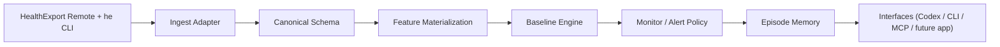

# Architecture

## Design Goal

Codex should be able to explain and investigate the system, but the source of truth must live in VitalClaw's own engine and storage.

## Layers

## Layer Responsibilities

### Ingest Adapter

- call the official `he` CLI and read JSON output
- normalize names, units, timestamps, and source metadata
- emit canonical observations

### Canonical Schema

- observations
- daily or nightly feature windows
- baselines
- deviations
- alerts
- episodes
- intervention outcomes

### Feature Materialization

Convert raw observations into alertable daily features such as:

- sleep duration
- sleep fragmentation
- resting heart rate
- HRV
- respiratory rate
- wrist temperature
- activity load

### Baseline Engine

- long baseline: 42-56 days
- short baseline: 7-14 days
- robust statistics
- anomaly-window exclusion to avoid baseline pollution

### Monitor / Alert Policy

- choose when to open an alert
- suppress noisy single-signal changes
- ask one question that most reduces uncertainty
- track unresolved and worsening states

### Episode Memory

- group alerts into episodes
- attach context events
- record interventions
- record outcomes
- compare against prior similar episodes

## Interface Rule

Codex is an interface client, not the runtime of truth.
